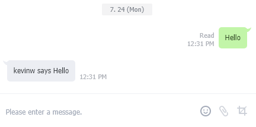

# Lab 1 - Chatbot Deployment

## Mission

* Deploy the chatbot on heroku 
* Test the chatbot with your account
* Trace some source code and answer the questions in demo section

## Things to read prior to the lab

1. Offline-tutorial 1: Using Github
2. Offline-tutorial 2: Conversion from C++ to Java

## Description

Throughout this course we are building a chatbot (a chatting robot) on an instance messager LINE. LINE has provided a very comprehensive framework called the "Message API" for developers to develop their chatbot. Based on this framework, we have done some modifications as your starting code for the project. The project is all written in Java so you need to pick up some Java language in your offline tutorials.

The framework of our project is shown below. A LINE client running on a mobile phone add a chatbot friend and send a message to it. The message will be first received by the LINE server. The LINE server will relay the message to a server registered by the bot owner. In our case, we are using a server called Heroku. A Java application running on the server will analysis the messages received and reply to the LINE server and then relay to the client. 

In Lab 1 you are required to deploy the chatbot app provided by us on Heroku and test the chatbot with your line client. 

## Registration

You need to register an account with following services. None of them will require you to pay despite all of them allow/encourage you to do it. We strongly advise NOT to register your credit card info with these server until you have completed this course. 

### LINE client

Download a LINE client on your mobile phone. 
 

During the development stage, you may want to use your laptop for testing. You can install the [Line Chrome Extension](https://chrome.google.com/webstore/detail/line/menkifleemblimdogmoihpfopnplikde) on your Chrome browser. Please remember to log out the LINE web client when you leave the Lab!

### LINE@ account with the LINE Business Center 

LINE@ account allows you to manage a LINE account for your business. We advise you to register a new LINE@ account even if you have one already. Refer to the following steps to create your LINE@ account which is adopted from https://developers.line.me/messaging-api/getting-started . There are three steps you need to do:

#### Create a LINE@ account with the Messaging API enabled

1. In the LINE Business Center, select Messaging API under the “Service” category at the top of the page.
2. Select either Start using Messaging API or Start Developer Trial. For more information on the Developer Trial plan, see Messaging API.
3. Enter the required information (account name, business type) for your new LINE@ account. Confirm the information.
4. Click the LINE@ MANAGER button at the bottom of the confirmation page to go to the ~~`Bot Settings`~~ (Latest version shall be called `Messaging API Settings` page of the LINE@ Manager.
5. On the `Messaging API Settings` page, click Enable API.
6. Configure your bot by following the steps in [Configure your bot](https://developers.line.me/messaging-api/getting-started#set_up_bot).

#### Configure your LINE@ account

To respond to messages from your users using the Messaging API, you first need to enable webhooks for your LINE@ account on the LINE@ Manager. You’ll then need to get a Channel access token and set a webhook URL on the Channel Console.

1. In the LINE@ Manager, go to the `Messaging API Settings` page, which can be found under “Settings” on the side menu
1. To reply to messages using webhooks, select Allow for “Use webhooks” under “Request Settings”. Make sure your `Auto Reply Message` is left as `Don't allow` to avoid the default greeting message.

#### Channel Console

Your bot application requires a Channel access token to call APIs and a webhook URL to receive webhook payloads. Channel access tokens are issued from the Channel Console and the webhook URL is the endpoint of your bot application’s server where webhooks payloads are sent.

1. Go to your LINE@ account page in the LINE Business Center.
2. In the “Messaging API” section, select the LINE Developers button to go to the Channel Console.
3. To issue a Channel access token for accessing APIs, click ISSUE for the “Channel access token” item
4. Click EDIT and set a webhook URL for your Channel 

   Note:The webhook URL must use HTTPS and have an SSL certificate issued by an authorized CA.

### Heroku

Heroku is a platform as a service (PaaS) that enables developers to build, run, and operate applications entirely in the cloud.

Go to Heroku and register an account [here](https://www.heroku.com/). Note, you may want to try with another browser if you failed to register it with Chrome.

So far you should have registered a line client (mobile phone), a LINE@ account with Messaging API enabled, and a Heroku account.

## Start to Deploy

Click [here](./sample-spring-boot-kitchensink/README.md) for the deploy guide.

## Checking Heroku Log

In case you have done something wrong in the above steps, your Heroku would not be able to start the app or running it with error. Go to your Heroku app and click "More" at the top right corner and "View Log". Keep this screen until you have finished demo your lab.

## Test your bot

Add your bot as your friend in the LINE client. Type "Hello" to greet him.

## Code tracing

Now you would need to open sample-spring-boot-kitchensink/src/main/java/com/example/bot/spring/KitchenSinkController.java and do some code tracing. You may want to check it against the Heroku Log. 

# Questions and Demo

You should aware that the bot will echo on what you say for most of the text input, except three words. Identify them from the code tracing and screen-capture those response. 

After you have completed this task, raise your hand and demo it to your TA. Please understand that there are so many students in the room and we have limited manpower. Pick a seat closer to the screen to have an earlier demo.

Note: This is an individual task and you should perform this task on your own.

