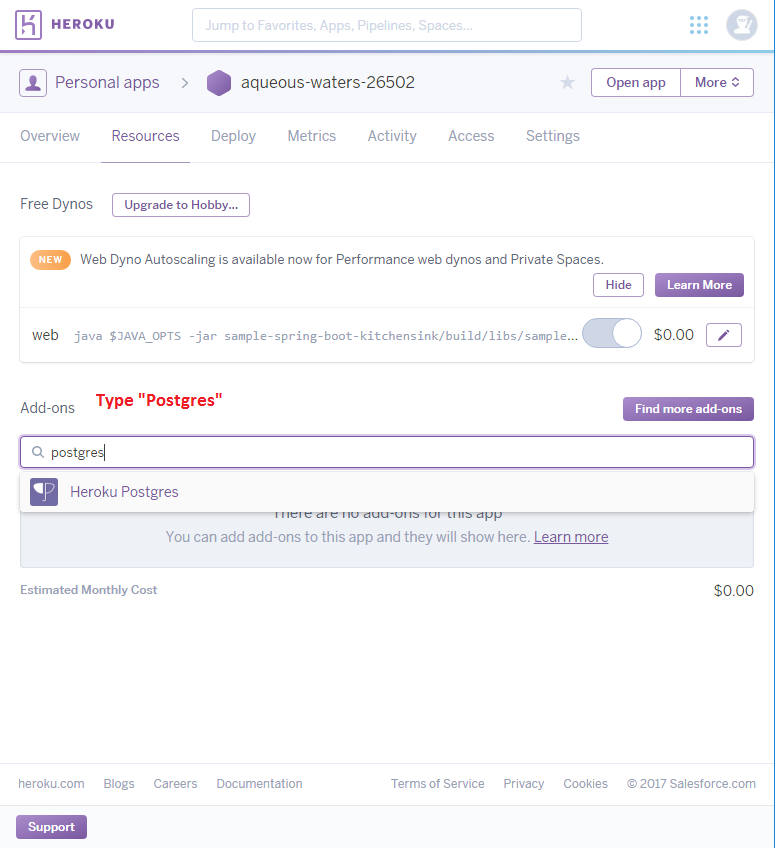
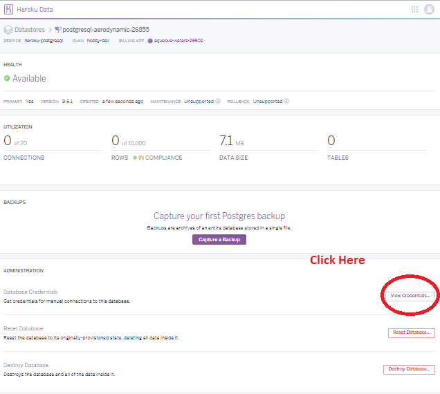
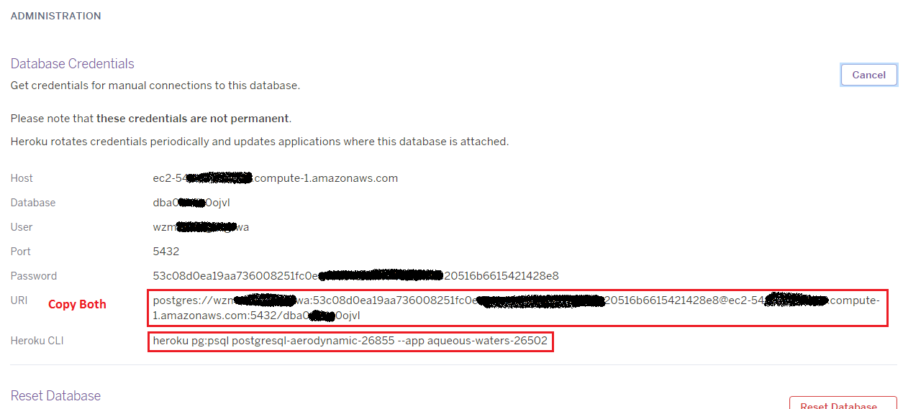

# Lab 3 - Chatbot with SQL Database

## Mission

* Create a database on heroku.
* Access the database locally.
* Access the database on heroku.
* Create a unit test for your database Engine.
* Make your bot connected to the Database.


## Things to read prior to the lab

1. Offline-tutorial 1: Using Github
2. Offline-tutorial 2: Conversion from C++ to Java
3. Offline-tutorial 3: A Brief Introduction to DBMS and PostgreSQL

## Description

In this rather inefficient and insecure to use a static file to maintain your keywords and responses. A better way to do it is to employ a database system. Before going to this lab, you need to read the offline tutorial about database and install suitable software on your machine.

In this lab you are going to add a PostgreSQL database to your chatbot. The database is also hosted on heroku (technically it is hosted somewhere else but you don't need to worry about it). You will be using command line tools to create a database table and insert data. You should create a class inherit `DatabaseEngine` that connects to the PostgreSQL database and do the searching. 

## Installation

You are recommended to install the following software in your machine. This is available at lab `L:\apps\comp3111\pgsql\bin`.

* [PostgreSQL Client 9.5.7 or above](https://www.postgresql.org/download/)

> Note: we are not running PostgreSQL server in our machine but you need a command line client to access the database. You may try some third party psql clients but we have not tested it.

> To test if your installation is complete, type `psql` in terminal.


## Creating a database on heroku

Follow the steps below to create a PostgreSQL on heroku.

1. Go to [heroku dashboard](https://dashboard.heroku.com/) and select your app. 
2. Click Resource and search for `Heroku Postgres`.



3. Click to add a `Heroku Postgres` data resource. Please be reminded to select a free plan.
4. Try to locate your newly added data resource on the webpage and select `View Credential`.



5. You should find the details of your credential




You will need your `URI` and `Heroku CLI` later.

After these steps, you have already created a Database and registered a user and password already. Referring to the offline tutorial, you have completed Section 3 already.


## Operating the database in command line mode.

Open your terminal and paste the `Heroku CLI` you have copied previously. This will command the Heroku to connect to the database. You need to install the `Heroku CLI` to do it (avaliable on L:\apps\comp3111\heroku\bin).
```
# Replace the xxxxx and yyyyy with your Heroku CLI
L:\apps\comp3111\heroku\bin\heroku pg:psql postgresql-xxxxxxx-xxxxx --app yyyyyy-yyyyyy-yyyyyy 
```

> :exclamation: Contingency: in case the Heroku CLI does not work, you can use the URI to connect directly with your psql.
> ``` psql YOUR_URI  ```


Referring the instruction in the offline tutorial to create a table and insert at least 5 pairs of keyword-response records.


## Working with your BOT

It is very similar to Section 5 of the offline tutorial that you need to create a Connection, a PreparedStatement, execute the query, and obtain the result. The file `SQLDatabaseEngine.java` is a skeleton code that contains the private method `Connection getConnection()`. With that you can construct your `String search(String)` method. 

> Don't forget to change the constructor of KitchenSinkController so that SQLDatabaseEngine will replace DatabaseEngine.

## Unit Test

Of course you need to perform Unit Test on your SQLDatabaseEngine. Edit the file `KitchenSinkTester.java` and replace the following line as below. It is to inform the Tester to test SQLDatabaseEngine instead.
```
//@SpringBootTest(classes = { KitchenSinkTester.class, DatabaseEngine.class })
@SpringBootTest(classes = { KitchenSinkTester.class, SQLDatabaseEngine.class })
```

When you deploy the code on heroku, the `URI` can be obtained from the environment variable `DATABASE_URL`. When you perform local test you need to specify the `URI` in your environment variable in your gradle configuration file. Gradle is a dependence management software like makefile, but it is more advanced. Open `sample-spring-boot-kitchensink/build.gradle` in your Eclipse STS. you should see something like

```
apply plugin: 'org.springframework.boot'

dependencies {
    compile project(':line-bot-spring-boot')
    compile group: 'postgresql', name: 'postgresql', version: '9.0-801.jdbc4'
}

test {
    environment "DATABASE_URL", "PUT_YOUR_URI_HERE" 
}
``` 

The first line says this project is a spring boot project where our project is building on this framework. The dependencies block specifies that the line-bot-spring-boot project needs to be built in order to build this KitchenSink. Also it requires the package `postgresql` with a specific version. During the compliation gradle will download the postgresql package from a public repository. The test block states that when the task `test` is execute, it sets the environment variable "DATABASE_URL" as your URI. You need to paste the URI you copied from web earlier to here. 


# TODO Tasks and Demo

1. Create a database on heroku and insert data into it.
2. Complete the SQLDatabaseEngine so that it responses like Lab 2 except the result is stated in the database. (For COMP3111H student partial match should be implemented.)
3. Test SQLDatabaseEngine locally and pass all test cases.


## For COMP3111H student

4. Store the number of hits of keyword into the Database. Append this number in your response. You may assume there is only one keyword per message.

After you have completed this task, raise your hand and demo it to your TA. Please understand that there are so many students in the room and we have limited manpower. Pick a seat closer to the screen to have an earlier demo.

Note: This is an individual task and you should perform this task on your own.


