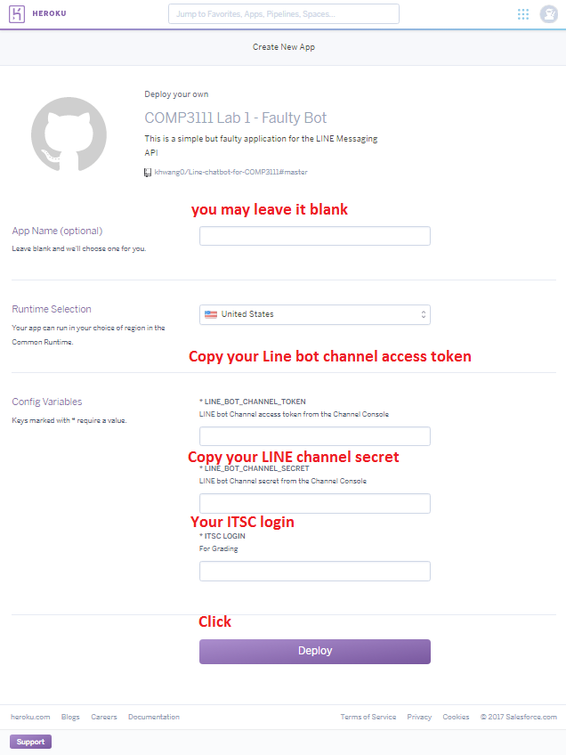

# The Messaging API SDK for Java

## Deploy on Heroku

Deploy this module on Heroku.

### Step 1

Get the Channel access token and Channel secret from the Channel Console.

### Step 2

Tap the deploy button.

### Step 3

Fill in the form and run your instance.

> Contingency
> In case Step 3 does not work, type the following in your terminal instead. You will need to install `git` and `heroku cli` in your machine. In our lab, `git` is installed and `heroku cli` is available at `L:\apps\comp3111`
> 1. git clone https://github.com/khwang0/Line-chatbot-for-COMP3111.git
> 2. heroku create
> 3. heroku heroku config:set LINE\_BOT\_CHANNEL\_TOKEN=1234 LINE\_BOT\_CHANNEL\_SECRET=\4567 ITSC\_LOGIN=kevinw  #assume 1234, 4567, and kevinw are the values you are having from Step 1.
> 4. git push heroku master

### Step 4

Tap the **Manage App** button and copy the name of your Heroku instance.

### Step 5

Set the webhook URL for your Channel on the Channel Console using the following URL:
`https://${YOUR_HEROKU_APP_NAME}.herokuapp.com/callback`

